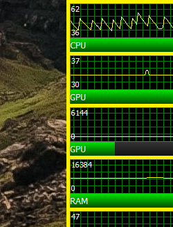
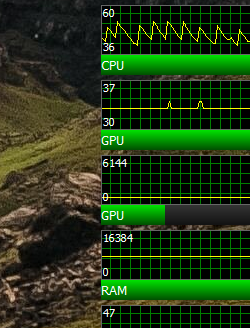

#  BGSnippet
**Technology:** Windows Forms

**Description:** Workaround for AIDA64's lack of transparent sensor panel background.
Solves the problem described [here](https://forums.aida64.com/topic/1946-sensorpanel-transparent-background/?tab=comments#comment-18738), by getting triggered upon the change of Windows desktop background image, and extracting appropriate piece of current desktop wallpaper to a user specified file. 

**Setup and demo video:**

**Screens:**

